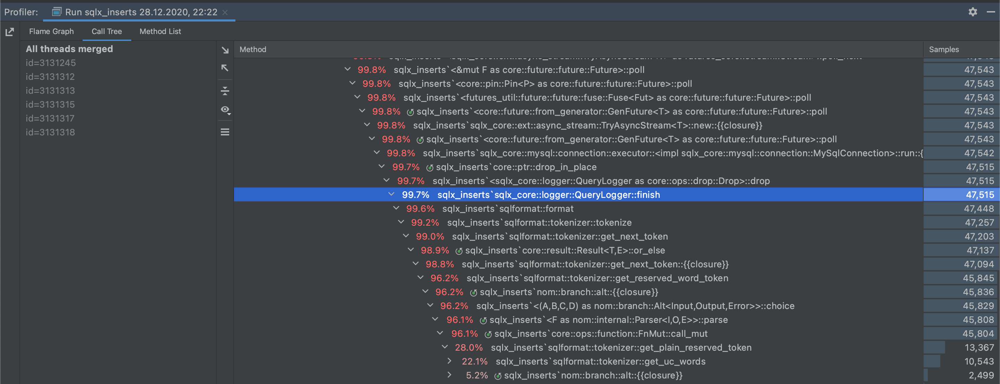

This tiny project is created to demonstrate issues that currently latest sqlx has with "executing" the db requests, mentioned in https://github.com/launchbadge/sqlx/issues/942.

Actual slowliness seems to be due to the sql query formatting code, according to the trace: 

# Running

1. Use `docker-compose.yml` to start the local database (`docker-compose up -d` or start it locally yourself somehow)
2. Run the app and note how much time it takes to insert a single query (over 700ms for me)
3. Uncomment the commented lines under the `uncomment this to improve the performance` and rerun the app again and notice `100x` performance improvements
